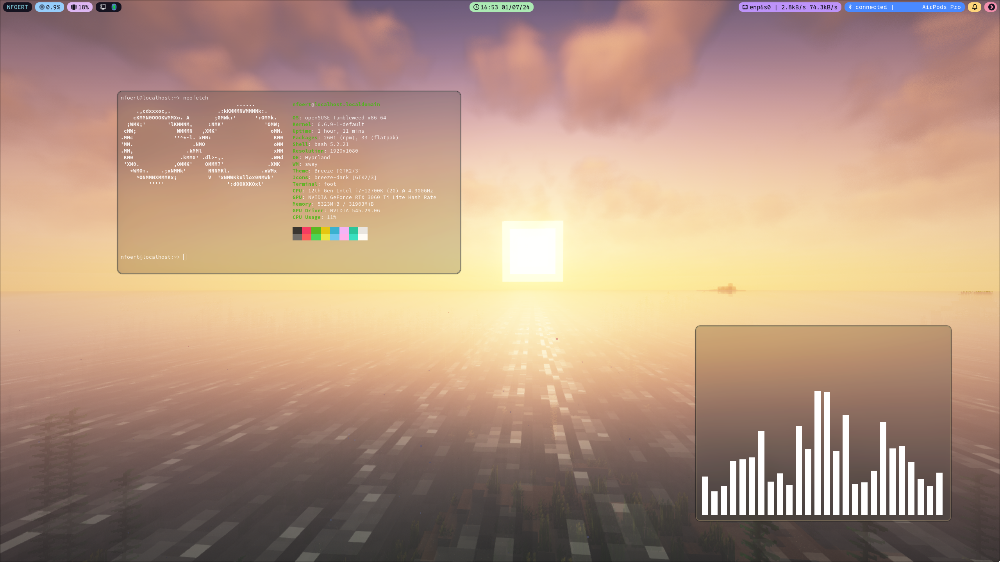

# Hyprland Dotfiles
Dotfiles for my Hyprland setup



```
OS: openSUSE Tumbleweed x86_64
DE: Hyprland
Greeter: sddm
Terminal: foot
Status Bar: waybar
Power Menu: nwg-bar
Screen Locker: swaylock-effects
App Launcher: rofi
File Manager: nautilus
```

## Utilities
```
waybar (built from source to use Hyprland features)
rofi
nwg-bar (built from source)
jirutka/swaylock-effects (https://github.com/jirutka/swaylock-effects, built from source)
cava
neofetch
notify-send
swaync-client
```

## Credits
Wallpaper: Taken by me, in Minecraft, with shaders

Initial Waybar config, modified some: https://github.com/theCode-Breaker/riverwm/tree/main/waybar/river
